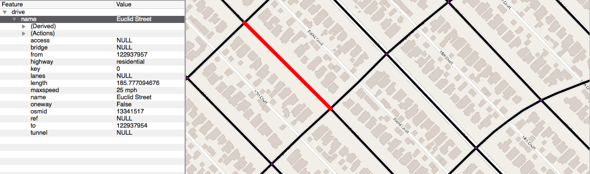
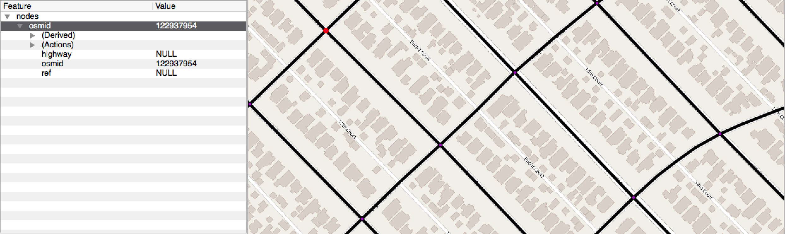
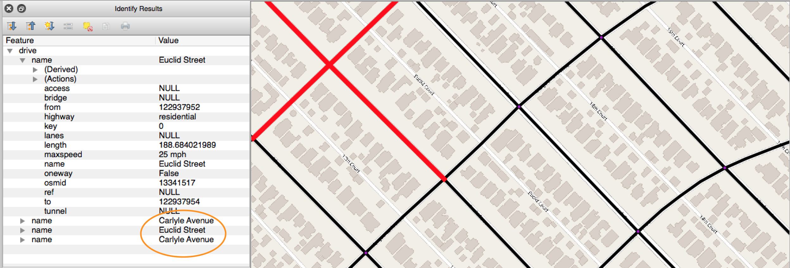

# geo-street-talk-global
_ARGO team lead: David Marulli ( david@argolabs.org )_

## High-level Description
Imagine looking at any non-cartographical data visualization or UI component (tables, graphs, text, etc.) that aims to display, say, characteristics of the worst potholes in the city. To represent the location, we could display a coordinate (e.g. 40.7217267,-73.9870392), but without looking at a map, where is this?

One could imagine instead displaying an address (i.e. 263 E Houston St), but, again, without looking at a map, even to a native New Yorker like myself, I don't know immediately know if this is on the east or west side of the city.

Building on a [solid foundation](https://medium.com/a-r-g-o/introducing-geo-street-talk-c11bd2306ff1), the deliverable of this project will programmatically output more immediately meaningful descriptions (i.e. "Houston Street between Avenue B and Avenue C").

As folks who are in the data weeds day-to-day, it's important to not lose sight of higher-level user experience.

## Approach
OSMnx is a python package that allows one to pull street networks for cities around the world. geopandas is a python package for processing geospatial data. Using these two packages as our foundation, we should be able to create a tool that recieves a lat/lng pair and returns a conversational string, such as "Houston Street between Avenue B and Avenue C". Below are the major steps we can follow:

1. Use OSMnx to get a street graph
2. Given a lat/lng point, query for nearest street segment
3. Get to/from node IDs
4. Using lat/lng pairs of node, query for intersecting streets
5. Compare street names of intersecting streets with original segment to determine to/from streets

### Example screenshots
#### OSMnx street segment attributes

#### OSMnx "from" node attributes

#### OSMnx intersecting street names

